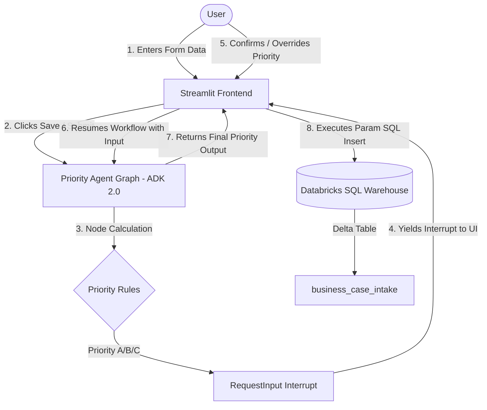

# Capstone White Paper: Business Case Priority Intake Form

**Project Name:** Business Case Priority Intake Form  
**Course:** Capstone Project Submission  
**Date:** July 1, 2026  

---

## 1. Executive Summary and Problem Statement

Organizations struggle with project intake, management, and resource allocation. Subjective evaluation methods, unstructured input fields, and manual tracking lead to delayed approvals, misaligned investments, and fragmented data repositories. 

The **Business Case Priority Intake Form** resolves these issues by delivering a structured, secure, and intelligent web intake portal. It combines modern web-based form elements (Streamlit), serverless relational databases (Databricks SQL Warehouse), and agentic coordination (Google ADK 2.0) to standardize the collection and categorization of corporate initiatives.

### Core Problems Addressed
* **Data Incompleteness**: Traditional intake forms suffer from empty text fields, complicating analysis. By enforcing strict constraints on core fields (Project Name and Description) and auto-generating standard fallbacks (`"Not Applicable"`) for optional fields, we ensure data integrity.
* **Subjective Prioritization**: Initiatives are often prioritized based on influence rather than quantifiable business value. Our solution establishes a structured, rule-based prioritization mechanism.
* **Lack of Review Control**: Fully automated systems risk false positives, while fully manual systems create operational bottlenecks. Introducing a Human-in-the-Loop (HITL) step allows humans to review and override automated decisions.
* **Disconnected Data Warehouses**: Project documentation and databases are frequently disconnected. Direct Delta Lake integration ensures immediate, structured storage.

---

## 2. System Architecture

The application is built on a 3-tier decoupled architecture combining a responsive frontend portal, an agentic graph runtime, and an enterprise data warehouse.

### Architectural Components
1. **Frontend Portal (Streamlit)**: Serves as the user interface, styling the workspace with a clean light theme (`#ffffff` background and indigo `#4f46e5` accents). It calculates form completion progress dynamically and displays the Priority Agent's review card when interrupted.
2. **Orchestration Agent (Google ADK 2.0 Graph Workflow)**: Manages state, handles data schemas, executes business logic, and schedules human verification requests.
3. **Data Warehouse (Databricks Delta Lake)**: Serves as the repository, capturing the project name, description, dynamic KPIs (stored as JSON arrays), business impacts, and final priority assignments.

---

## 3. Solution Details and Agent Intelligence

### Intelligent Intake Form
The user enters qualitative details across three structured tabs:
* **Problem Statement**: Standardizes project definition, stakeholder analysis, and status-quo cost calculations.
* **Value and KPIs**: Focuses on value creation linkage and allows the user to dynamically add, remove, and track metrics.
* **Business Impact**: Collects strategic alignment vectors (Revenue, Cost, Customer Service, Process Efficiency, Process Duration, and Quality).

### The Priority Agent Graph (ADK 2.0 Workflow)
The Priority Agent runs as an ADK 2.0 Graph Workflow consisting of a custom function node wired to the `START` entry point. It evaluates impact choices against business logic:

| Rule Category | Condition | Assigned Priority |
| :--- | :--- | :--- |
| **Rule A** | Revenue = `Increase` **AND** Cost = `Saving` | **Priority A** |
| **Rule B** | Customer Experience = `External` **OR** Quality = `Product` | **Priority B** |
| **Rule C** | Any other combination of strategic inputs | **Priority C** |

### Human-in-the-Loop (HITL) Integration
Instead of saving calculations directly, the system includes a human confirmation step:
1. The agent yields `RequestInput` with the computed priority.
2. The workflow pauses and generates a unique `invocation_id`.
3. The Streamlit frontend intercepts this interrupt, rendering a review panel prompting the user to keep the assignment or choose an override (*A, B, or C*).
4. The user's selection is returned to the runner. The workflow resumes, logs the decision, and returns the final priority to the frontend to complete the database insert.

---

## 4. Database Schema

All submissions are stored in the catalog `pm_test1`, schema `pm_test1_schema`, and table `business_case_intake` with the following schema:

| Column Name | Data Type | Description |
| :--- | :--- | :--- |
| `project_name` | `STRING` | Unique identifying title of the project (Required) |
| `problem_solving` | `STRING` | Project description and core problem statement (Required) |
| `who_impacted` | `STRING` | Stakeholders and units impacted by the problem |
| `cost_impact` | `STRING` | Current operational/financial cost of the problem |
| `other_details` | `STRING` | Assumptions, constraints, or background information |
| `value_creation` | `STRING` | Direct linkage to value creation driver models |
| `kpis` | `STRING` | Serialized JSON array containing dynamic KPI metrics |
| `impact_revenue` | `STRING` | Revenue impact rating (Increase, Protection, No Impact) |
| `impact_cost` | `STRING` | Cost impact rating (Saving, Avoidance, No Impact) |
| `impact_cust_service` | `STRING` | Customer service audience (External, Internal, No impact) |
| `impact_efficiency` | `STRING` | Process efficiency impact (Improvement, No impact) |
| `impact_duration` | `STRING` | Process duration impact (Reduction, No impact) |
| `impact_quality` | `STRING` | Quality focus area (Product, Data, No impact) |
| `priority` | `STRING` | Final approved priority (A, B, or C) |
| `submitted_at` | `TIMESTAMP` | Server timestamp of database commit |

---

## 5. Further Enhancement Opportunities

The current implementation provides a foundation that can be expanded with the following enhancements:

* **Predictive Priority Classification (LLM-as-a-Node)**: Integrate a Gemini node in the ADK workflow to analyze raw text fields (e.g., Problem Description and Value Creation) and suggest priority classifications, complementing the rule-based approach.
* **Auto-Generated Financial Estimates**: Use LLMs to parse text inputs and estimate financial metrics, such as Return on Investment (ROI) or Net Present Value (NPV).
* **Multi-Stage Workflow Approvals**: Extend the graph with multiple `RequestInput` nodes to route priority reviews to managers and finance directors based on estimated budget thresholds.
* **System Integrations**: Set up webhooks or event loops to automatically sync approved entries to task management tools like Jira or ServiceNow.
* **Analytics Dashboards**: Build a Databricks SQL dashboard to visualize intake pipelines, KPI trends, and strategic resource allocation.

---

## 6. Conclusion

The **Business Case Priority Intake Form** demonstrates how agentic orchestration can improve business operations. Combining a user-friendly frontend, structured logic, and database integration reduces manual processing times, improves data quality, and establishes transparent governance. Leveraging the ADK 2.0 Graph Workflow API allows the application to balance automation with human oversight.
