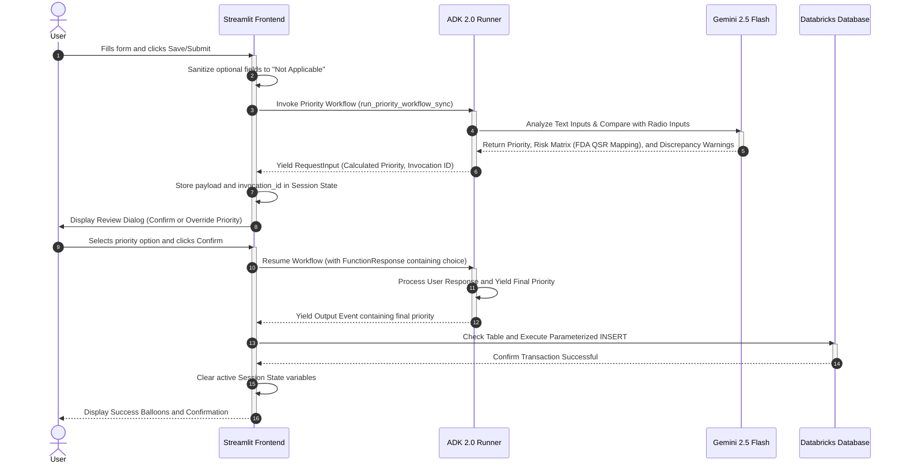

# System Architecture: Business Case Priority Intake Form

This document provides a technical overview of the system architecture for the **Business Case Priority Intake Form** application. 

---

## 1. System Topology and Tier Architecture

The application is structured as a three-tier decoupled architecture:
1. **User Interface / Presentation Tier**: Streamlit web application.
2. **Agent / Processing Tier**: Google ADK 2.0 Graph Workflow + Gemini LLM Semantic Analyzer.
3. **Storage / Data Warehouse Tier**: Databricks SQL Warehouse (Delta Lake).

```mermaid
graph TB
    subgraph Presentation Tier (Streamlit)
        UI[App Frontend UI]
        State[Session State Manager]
        Copilot[AI Copilot Assistant]
    end
    
    subgraph Agentic Orchestration Tier (Google ADK 2.0 + Gemini)
        Runner[InMemoryRunner]
        WF[Workflow Engine]
        Node[determine_and_confirm_priority Node]
        LLM[Gemini 2.5 Flash API]
    end
    
    subgraph Storage Tier (Databricks)
        Conn[SQL Connector]
        DB[(Delta Lake Table)]
    end
    
    UI ---|Local Interactions and Reruns| State
    UI -->|Execute run_priority_workflow_sync| Runner
    Copilot <-->|Context Chat & Suggestion| LLM
    Runner ---|State Management and Resumption| WF
    WF -->|Invoke Node Logic| Node
    Node -->|Run Semantic & Risk Prompt| LLM
    LLM -->|JSON Results & Risks| Node
    Node -->|Yield RequestInput / Event| WF
    WF -->|Yield Control / Final Output| Runner
    Runner -->|Priority Output| UI
    UI -->|Execute Insert| Conn
    Conn -->|Delta Transactions| DB
```

---

## 2. Dynamic Integration and Interaction Flow

The interaction logic is designed to support asynchronous human-in-the-loop validation within a synchronous frontend execution flow.



---

## 3. Tier Component Specifications

### 3.1. Presentation Tier (Streamlit)
* **Design and Theme**: Overridden globally via `.streamlit/config.toml` to enforce a clean light mode layout with white backgrounds (`#ffffff`), slate text (`#0f172a`), and indigo UI highlights (`#4f46e5`).
* **Session State Management**: Tracks active state across user interactions:
  * Form inputs (e.g. project name, problem solving).
  * Dynamic list of KPI objects.
  * Integration configuration parameters (Databricks settings, Gemini API keys).
  * Active Priority Workflow run session parameters (`priority_run_session_id`, `pending_priority_confirmation` containing the active `invocation_id` and the database payload).
* **AI Copilot Integration**: Utilizes the Google GenAI SDK to spin up a helper in Tab 4, reading the live state of form fields to answer clarification questions or draft metrics.

### 3.2. Orchestration Tier (Google ADK 2.0)
* **Agent Scaffolding**: Utilizes the `Workflow` class from `google.adk.workflow`. 
* **Graph Definition**: Configured with a `START` node connected to a single processing node:
  * Processing Node: `determine_and_confirm_priority` decorated with `@node(rerun_on_resume=True)`.
  * Schemas: Input is validated via a Pydantic `ProjectData` model.
* **Semantic Analysis & Compliance Check (Gemini LLM)**:
  * Every execution triggers a structured JSON prompt to Gemini.
  * Checks inputs against **5 High-Risk Categories** (Intended Use, Software, Materials, Clinical, Manufacturing, and direct Patient Harm), mapping issues directly to sections of **FDA 21 CFR Part 820 Quality System Regulations** (CAPA, Design Controls, Production Controls, etc.) and international standards.
  * **Sanity Mismatch Check**: Evaluates if the text fields describe business impacts (Product Quality, Revenue, Cost, Customer Experience) that do not align with the selected radio buttons. Auto-promotes priority on conflict and outputs warnings.
* **Interrupt State Handling**: Uses the `RequestInput` class from `google.adk.events.request_input`. 
  * If the input is not yet verified, it yields `RequestInput` with the computed value, interrupting workflow execution.
  * Resumption is executed via `runner.run_async()` by passing the active `invocation_id` and a `FunctionResponse` matching the interrupt signature.

### 3.3. Database and Storage Tier (Databricks)
* **Connection Interface**: `databricks-sql-connector` library executing over Databricks SQL Warehouse instances.
* **Authentication**: Supports both token-based login and automated OAuth credential resolution via the Databricks SDK (`databricks-sdk`) when deployed inside Databricks Apps.
* **Schema Evolution and Safety**:
  * Employs `CREATE DATABASE IF NOT EXISTS` and `CREATE TABLE IF NOT EXISTS` commands to ensure target storage paths are validated on run.
  * Executes an `ALTER TABLE ... ADD COLUMN IF NOT EXISTS priority STRING` migration query during connection validation to support schema updates without breaking existing data.
  * All database operations utilize parameterized queries (`?` syntax placeholders) to protect against SQL injection vulnerabilities.
